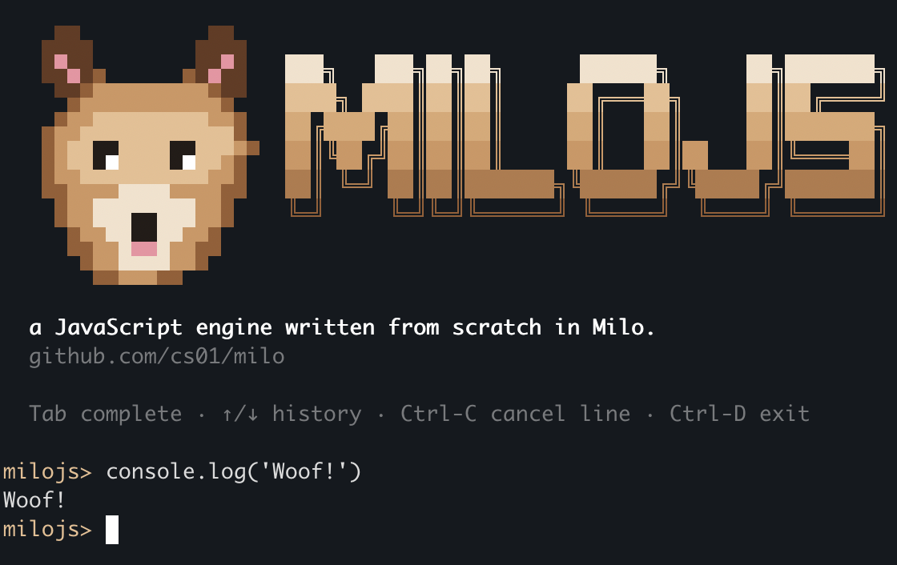

# milojs

<p align="center">
  
</p>

A JavaScript engine and runtime, written in the
[Milo](https://github.com/milo-language/milo) programming language. 

The runtime is in the same family as node, deno, bun (though obviously less mature).

Unlike node, deno, and bun which use existing JavaScript engines like V8 and JavaScriptCore, milojs uses milojs-engine, a JavaScript engine written in Milo. 

milojs-engine is a few thousand lines and executes code by parsing and running the parsed code directly, as opposed to a sophisticated JIT. This makes milojs-engine far simpler than V8 and JavaScriptCore, but slower.

There are two binaries in this repository:

- `milojs-engine` — runs raw JavaScript with no host bindings. Similar to QuickJS.
- `milojs` - A node-compatible runtime, similar to node, deno, or bun. It can load modules, has an event loop, can access the filesystem, etc.

### Formally Verified

Parts of the code is formally verified to guarantee correctness using Milo's contracts. 

## Install

```sh
P=$(uname -s | tr A-Z a-z)-$(uname -m | sed 's/x86_64/x64/;s/aarch64/arm64/')
curl -fsSL https://github.com/milo-language/milojs/releases/download/latest/milojs-$P.tar.gz | tar xz
cd milojs-$P
```
Run it:
```sh
./milojs --version
./milojs script.js
```
or 
```
./milojs-engine --version
./milojs-engine script.js
```

## Node-API: real native addons

milojs implements the Node-API (N-API) C ABI to load and run real
`.node` addons — compiled shared libraries