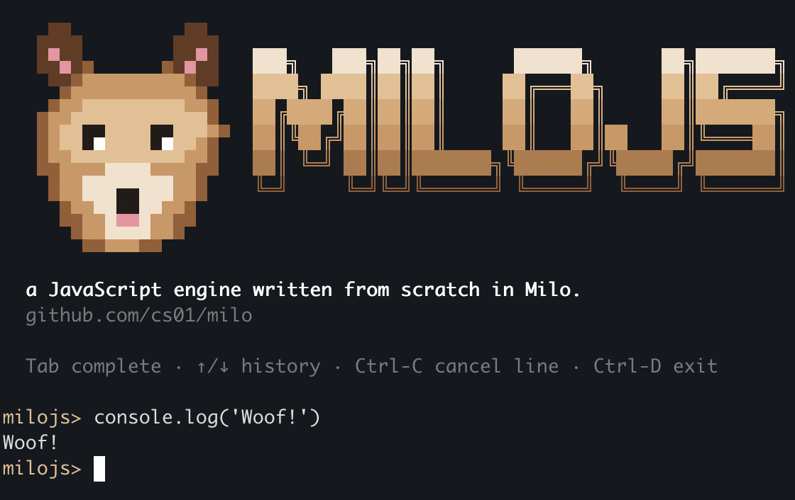

# milojs

[](https://github.com/milo-language/milojs/actions/workflows/ci.yml)

<p align="center">
  
</p>

A JavaScript engine and runtime written in the [Milo](https://github.com/milo-language/milo) programming language. Two binaries:

- **`milojs-engine`** — an embeddable JavaScript engine. Raw JS, no host bindings, links into a native program as a static library.
- **`milojs`** — a full runtime in the same space as Node, Deno and Bun: modules, event loop, filesystem and network, Node-API addons.

Experimental, not yet a drop-in replacement for either.

## Engine Conformance

`milojs-engine` — the ECMAScript language.

| suite | score |
|---|---|
| [test262](https://github.com/tc39/test262) (<!--fact:t262-sample-->1500<!--/fact-->-case deterministic sample) | <!--fact:t262-pct-->77.5%<!--/fact--> (<!--fact:t262-pass-->1139<!--/fact-->/<!--fact:t262-scored-->1470<!--/fact-->) |
| [QuickJS test suite](https://github.com/quickjs-ng/quickjs) | <!--fact:qjs-pct-->54.4%<!--/fact--> (<!--fact:qjs-pass-->81<!--/fact-->/<!--fact:qjs-total-->149<!--/fact-->) |

<!--fact:qjs-parsefail-->28<!--/fact--> of the QuickJS cases never RAN: the engine could not parse the
source, and one missing syntax feature takes every case in its file with it. Of the
<!--fact:qjs-ran-->121<!--/fact--> that did run, <!--fact:qjs-ran-pct-->66.9%<!--/fact--> pass. Both
numbers are reported because they answer different questions: the first is what the
suite says today, the second is how the engine does on what it can read.

## Node Conformance

`milojs` — modules, event loop, host bindings.

| suite | score |
|---|---|
| [Node `test/parallel`](https://github.com/nodejs/node/tree/main/test/parallel) (all <!--fact:node-available-->3373<!--/fact--> externally runnable tests, <!--fact:node-excluded-->606<!--/fact--> node-internal excluded) | <!--fact:node-pct-->46.4%<!--/fact--> (<!--fact:node-pass-->1564<!--/fact-->/<!--fact:node-total-->3373<!--/fact-->) |

Node's own tests, unmodified, through Node's `test/common` harness, each invoked
as a plain `<binary> test.js`. The same harness scores any node-compatible
binary: node itself 87.5%, bun 45.5%.

For more details, see [docs/status.md](docs/status.md).

## Install

Rolling builds from the latest passing commit on `main`, for Linux x64/arm64 and macOS arm64:

```sh
P=$(uname -s | tr A-Z a-z)-$(uname -m | sed 's/x86_64/x64/;s/aarch64/arm64/')
curl -fsSL https://github.com/milo-language/milojs/releases/download/latest/milojs-$P.tar.gz | tar xz
cd milojs-$P
```

## Usage

<!-- exec -->
```sh
printf 'const name = "Milo"; console.log(`hello from ${name}`);\n' > hello.js
./milojs-engine hello.js
```

```text
hello from Milo
```

Run `./milojs` instead for the full runtime — `require`, ESM, timers, `fs`, `http`, `fetch` and Node-API addons. Run either with no arguments for a REPL.

## Embed The Engine

Build the static library, then compile the [C example](examples/embed/hello.c):

```sh
# Linux
milo build-lib src/libmilojs.milo -o libmilojs.a &&
cc -std=c11 -I. -Iinclude examples/embed/hello.c libmilojs.a -lm -lssl -lcrypto -lsqlite3 -ldl -pthread -o hello &&
./hello
```

```sh
# macOS
milo build-lib src/libmilojs.milo -o libmilojs.a &&
cc -std=c11 -I. -Iinclude \
  -I"$(brew --prefix openssl)/include" -L"$(brew --prefix openssl)/lib" \
  examples/embed/hello.c libmilojs.a -lssl -lcrypto -lsqlite3 -pthread -o hello &&
./hello
```

```text
hello from embedded milo, woof! the answer is 42
```

The C ABI is a preview and single-context. API and ownership contract: [docs/milojs-embedding.md](docs/milojs-embedding.md).

## Build From Source

Needs the latest [Milo compiler](https://github.com/milo-language/milo/releases), Clang 16+, and OpenSSL headers.

```sh
tools/dev.sh          # build both binaries and run every suite
tools/precommit.sh    # fast checks before committing
```

## Development

[AGENTS.md](AGENTS.md) is the repository workflow. [docs/status.md](docs/status.md) is the capability dashboard, [docs/backlog.md](docs/backlog.md) is current work.

## License

[MIT](LICENSE).
